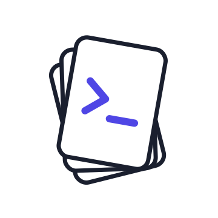

<p align="center">
  
</p>

# Personal Agent Skills

Portable [Agent Skills](https://agentskills.io/specification.md), versioned here and installed into coding agents from one canonical source.

## Layout

```text
skills/
  <skill-name>/
    SKILL.md
    scripts/       # optional deterministic helpers
    references/    # optional on-demand documentation
    assets/        # optional templates and resources
```

Skills live directly beneath this directory; do not nest categories because OMP discovers only `skills/<name>/SKILL.md`.

## Authoring contract

- Keep `SKILL.md` portable: valid Agent Skills YAML frontmatter with a `name` matching its directory and a useful `description`.
- Keep tool-neutral instructions in the core skill. Add Claude Code or OMP-specific behavior only when it is required.
- Use relative paths for bundled resources.
- Add scripts only when a deterministic helper is necessary. Python is the default scripting language for this collection; require `uv` only for a skill that needs it.

## Installation strategy

This repository is the **Canonical Source** (see `CONTEXT.md` for the full vocabulary; `docs/adr/0001` for the reasoning). Skills are *copied* — not symlinked — into the **Installed Set** at `~/.agents/skills`, selectively per machine, and reconciled by a three-way sync:

```sh
uv run scripts/skills-sync.py            # Textual TUI: install/remove/adopt, resolve conflicts
uv run scripts/skills-sync.py status     # per-skill state (--json for agents)
uv run scripts/skills-sync.py sync       # one-sided changes flow; conflicts reported — inspect with `diff <name>`, resolve with `accept`
```

Agent surfaces hold no content: `~/.claude/skills` is a single directory symlink to the Installed Set. Migrating from the old symlink-per-skill layout is `uv run scripts/skills-sync.py cutover` (dry-run by default, `--apply` to execute; backs up `~/.claude/skills` first).

For public multi-agent distribution, `npx skills@latest add gauthiermartin/skills` still applies.

## Sources and attribution

- Skills adapted from [Matt Pocock's skills](https://github.com/mattpocock/skills) and [Paul Iusztin's AI Research OS workshop](https://github.com/iusztinpaul/ai-research-os-workshop) record their origin in each skill's `metadata:` frontmatter (`origin`, `origin-path`, `origin-revision`, `origin-status`).
- `NOTICE` preserves both upstream MIT notices; `LICENSE` covers this repository's original contributions.

## Deferred

- No Node package, Python package, Claude Code plugin, or tool-specific adapters are included.
